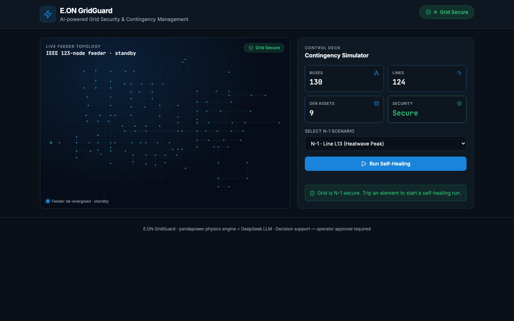
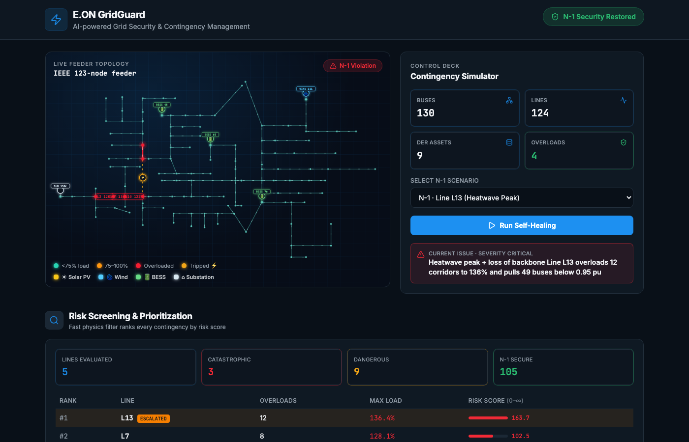
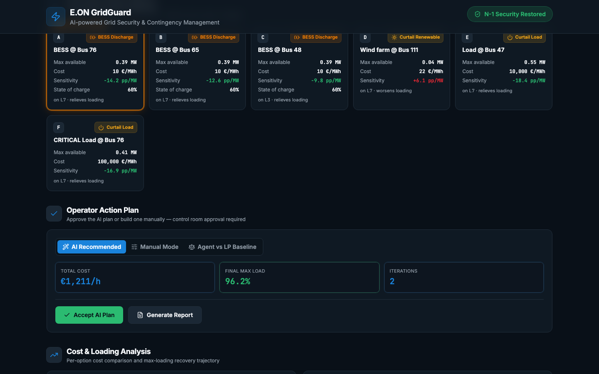

# GridGuard — AI-Powered Grid Security & Contingency Management

> **E.ON Hackathon · Energy × AI Grid Operation Agents Track**

GridGuard is a control-room decision-support dashboard for distribution-grid operators. It simulates N-1 contingency events on the IEEE 123-node feeder, ranks every contingency by risk score, builds a physics-informed corrective action space, and presents the operator with an AI-recommended dispatch plan — all visualised in real time.

---

## Screenshots

### Dashboard — idle (grid secure)


### N-1 Violation detected — Risk Screening results


### Corrective Action Space & Operator Action Plan


---

## Features

| Section | What it shows |
|---|---|
| **Grid Visualization** | Force-directed IEEE 123-node feeder; fault line highlighted in red, overloaded lines in amber, restored lines in green |
| **N-1 Risk Screening** | Two-stage DC→AC contingency screen — every line ranked by composite risk score (0 – ∞); islanding → ∞ |
| **Corrective Action Space** | Feasible BESS discharge / charge, renewable curtailment, load curtailment options — each with sensitivity (pp/MW), cost (€/MWh) and SoC |
| **AI Recommended Action** | Highest priority option flagged with `★ AI Recommended` — chosen by best sensitivity-to-cost ratio |
| **Operator Action Plan** | AI mode (accept plan), Manual mode (pick & dispatch any option), LP Baseline benchmark tab |
| **Economic Charts** | Per-option cost bar chart (log scale) + max-loading recovery before/after |
| **Corrective Loop** | DeepSeek LLM step-by-step reasoning and actions, cost per iteration |
| **Weather & Market Strip** | 12-hour forecast — temperature, solar/wind MW, balancing price (€/MWh), BESS SoC, derated assets |

### Three Preset Scenarios

| ID | Name | Condition |
|---|---|---|
| `n1-line13` | Heatwave Peak — Line 13 trip | 130% load · 16:00 · 34°C |
| `n1-line19` | Solar Midday — Line 19 trip | 100% load · 12:00 · clear |
| `n1-line55` | Storm Evening — Line 55 trip | 120% load · 18:00 · storm |

---

## Technology Stack

```
frontend/
├── React 19 + TypeScript
├── TanStack Router / Start  (file-based routing + SSR-ready)
├── Vite 8                   (dev server + production bundler)
├── Tailwind CSS v4          (design tokens, dark-mode ready)
├── Radix UI                 (accessible headless primitives)
├── Recharts                 (bar charts)
├── Lucide React             (icons)
└── src/lib/
    ├── grid-data.ts         (all TypeScript types + 3 simulated scenarios)
    └── ieee123-topology.ts  (IEEE 123-node bus/line topology for the viz)
```

The physics data (pandapower N-1 simulation on the IEEE 123-node feeder) was pre-run and embedded as structured TypeScript in `grid-data.ts`. There is no runtime server dependency.

---

## Quick Start

**Requirements:** Node.js ≥ 18

```bash
# 1. Install dependencies
cd frontend
npm install          # or: bun install

# 2. Start development server
npm run dev          # → http://localhost:8080

# 3. Production build
npm run build        # output in frontend/dist/
```

That's it — no database, no backend, no environment variables required.

---

## Project Structure

```
GridGuard/
└── frontend/                  # React/TypeScript SPA
    ├── src/
    │   ├── routes/
    │   │   └── index.tsx      # main dashboard (all panels)
    │   ├── components/
    │   │   └── GridVisualization.tsx   # IEEE 123-node D3-style canvas
    │   └── lib/
    │       ├── grid-data.ts            # types + 3 scenarios (mock data)
    │       └── ieee123-topology.ts     # bus/line coordinates
    ├── package.json
    └── vite.config.ts
```

---

## Physics & AI Model (background)

The scenarios embed results from a pandapower simulation pipeline:

1. **Two-stage N-1 screening** — DC power-flow screen across all 123 lines to shortlist risky contingencies; AC solve on the shortlist to compute exact overloads and voltage deviations.
2. **Risk score** = `severity × likelihood` — weighted sum of overloaded-line count, peak loading %, undervoltage depth × count, plus convergence/islanding penalty.
3. **Action space** — for each feasible DER (BESS, PV, wind, flexible load), sensitivity `Δloading_pp / MW` is computed; options sorted by `|sensitivity| / cost`.
4. **DeepSeek LLM corrective loop** — given the action space, network state, and weather context, the agent issues dispatch commands iteratively until N-1 security is restored or all actions are exhausted.
5. **LP baseline** — SCOPF-lite linear program provides a mathematical cost optimum for benchmark comparison.

Distribution-feeder dispatch priority: **BESS discharge → curtail renewables → shed load** (cheapest to most expensive per MW of relief).

---

## License

MIT — see [LICENSE](LICENSE) for details.

## Teammates

Mengyu Zhang
Chen Zhao
Cici
Yang Xu
Weiting Liang

---

*Built for the E.ON Hackathon 2025 · Energy × AI Grid Operation Agents Track*
